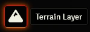
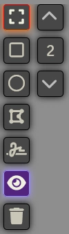

# Enhanced Terrain Layer
Adds a Terrain Layer to Foundry that can be used by other modules to calculate difficult terrain.

## Installation
Simply use the install module screen within the FoundryVTT setup

Please note, this module by itself only records the difficult terrain.  You'll need to use a ruler that accesses this module to see the changes when dragging a token.

## Usage & Current Features

### Terrain Layer





The various drawing tools work identically to the core Drawings tools. Left drag to start the shape, left-click to add a point, right-click to remove a point, and double-click to close the shape when you're done.  You can also add a grid square by double-clicking on the canvas.

You can then set how difficult that terrain is to move through, and what type of terrain it is, and if it affects ground based tokens or air based tokens.

Switching to the select tool you can resize an area or reposition the area as you would with most object in Foundry. You can also delete an area by pressing the delete key while the the area is selected.

The Terrain Layer will also let you assign difficulty to measured templates. You can use this for spells that set difficult terrain.

And it will also calculate other tokens so that when you're moving through another creatures square it will count as difficult terrain.

Terrain Layer can either be shown all the time, or hidden until a token is selected and dragged across the screen.  This can be changed using the Enable/Disable Terrain button with the other terrain controls.

You can also set blocks of Terrain to be active or not active, so if the difficult terrain is only temporary or conditional you can control it.

You can also set the environment that the difficult terrain represents.  So if you have water, or rocks, or arctic tundra you can record this information.  If you have a system that allows characters to ignore difficult terrain of a certain type, and a ruler that supports checking on this, then it can be added to the calculations.

You can set the color of the terrain, on an individual basis, a default colour for that environment, a default for the scene, or a general color.

### Token Integration

In the module settings, you can set whether to include live or dead tokens of either friendly tokens, hostile tokens, or both as difficult terrain.

## Rulers and measuring distance

Enhanced Terrain Layer only records difficult terrain, it doesn't do any measuring based on that information.  To get drag distances for Tokens I'd recommend using both Terrain Ruler and Drag Ruler.  Terrain Ruler will calculate the correct distance based on difficult terrain, and Drag Ruler provides a more visual representation of drag distances.

## Coding
### Requesting terrain cost for coordinates on the map
For those who are developing Rulers based on the Enhanced Terrain Layer, to get access to the difficulty cost of terrain grid you call the cost function.
`canvas.terrain.cost(pts, options);`
pts can be a single object {x: 0, y:0}, or an array of point objects.
options {elevation: 0, reduce:[], tokenId: token.id, token:token} lets the terrain layer know certain things about what you're asking for.

- elevation: adding a value for elevation will ignore all terrain that is a ground type if the elevation is greater than 0 and ignore any air terrain if the elevation is less than or equal to 0.  It will also ignore any tokens that aren't at the same elevation.
- reduce: [{id:'arctic',value:1}] will result in any calculation essentially ignoring arctic terrain. [{id:'arctic',value:'-1',stop:1}] will result in any calculation reducing the difficulty by 1 and stopping at 1.  You can also use '+1' to add to the difficulty.  stop is an optional parameter. And you can use the id 'token' to have these settings applied when calculating cost through another token's space.
- tokenId - pass in the token id to avoid having the result use the token's own space as difficult terrain.
- token - pass in the token, will use both the id and elevation of that token.  passing in elevation:false will result in the the function ignoring the token's elevation.
- calculate - this is how you'd like the cost to be calculated.  default is 'maximum', which returns the highest value found while looking through all terrains.  you can also pass in 'additive' if you want all costs to be added together.  And if neither of those work, you can pass your own function in to make the final calculation `calculate(cost, total, object)` with cost being the current cost and total being the running total so far and object being either the terrain, measure, or token that's caused the difficult terrain.
- verbose - setting this to true will return an object with 'cost' set to the total cost and 'details' as an array of all terrain object found.

A list of Terrain Environments can be found by calling `canvas.terrain.getEnvironments();` and can be overridden if the environments in your game differ.

if you need to find the terrain at a certain grid co-ordinate you can call `canvas.terrain.terrainFromGrid(x, y);` or `canvas.terrain.terrainFromPixels(x, y);`.  This is useful if you want to determine if the terrain in question is water, and use the swim speed instead of walking speed to calculate speed.

### Integrating game system rules
Other modules or game systems systems can indicate to Enhanced Terrain Layer how a given token should interact with the terrain present in a scene and how to handle stacked terrain. That way it's possible to integrate the rules of a given game system into Enhanced Terrain Layer. Enhanced Terrain Layer offers an API to which modules and game systems can register to provide the implementation of the respective rules to Enhanced Terrain Layer. Registering with the API works as follows:

```javascript
Hooks.once("enhancedTerrainLayer.ready", (RuleProvider) => {
  class ExampleGameSystemRuleProvider extends RuleProvider {
    calculateCombinedCost(terrain, options) {
      let cost;
      // Calculate the cost for this terrain
      return cost;
    }
  }
  enhancedTerrainLayer.registerModule("my-module-id", ExampleGameSystemRuleProvider);
});
```

If you're accessing the Enahanced Terrain Layer API from a game system, use `registerSystem` instead of `registerModule`. The `calculateCombinedCost` needs to implemented in a way that reflects the rules of your system. The function receives two parameters: The first parameter is a list of `TerrainInfo` objects (more on those in the next paragraph) for which the function should calculate the cost. The second parameter is an `options` object that contains all the options that were specified by the caller of `canvas.terrain.cost`. The function shall return a number that indicates a multiplier indicating how much more expensive it is to move through a square of indicated terrain than moving through a square that has no terrain at all. For example if moving thorugh a given terrain should be twice as expensive as moving through no terrain, the function should return 2. If moving through the given terrain should be equally expensive as moving through no terrain, the function should return 1.

The `TerrainInfo` objects received by this function are wrappers around objects that create terrain and allow unified access to the terrain specific properties. The following properties are offered by `TerrainInfo` objects:
- `cost`: The cost multiplicator that has been specified for this type of terrain
- `environment`: The environment speficied for this terrain
- `obstacle`: The obstacle value specified for this terrain
- `object`: The object that is causing this terrain

## Credit
The orginal idea came from the Terrain Layer module.  But in the process of re-developing it I realised that none of the original code remained.  This is why I branched out into a new module.  But I want to give credit to the original author Will Saunders.

## Bug Reporting
Please feel free to contact me on discord if you have any questions or concerns. ironmonk88#4075

## Support

If you feel like being generous, stop by my <a href="https://www.patreon.com/ironmonk">patreon</a>.  Not necessary but definitely appreciated.

## License
This Foundry VTT module, writen by Ironmonk, is licensed under MIT License

This work is licensed under Foundry Virtual Tabletop <a href="https://foundryvtt.com/article/license/">EULA - Limited License Agreement for module development from May 29, 2020.</a>
